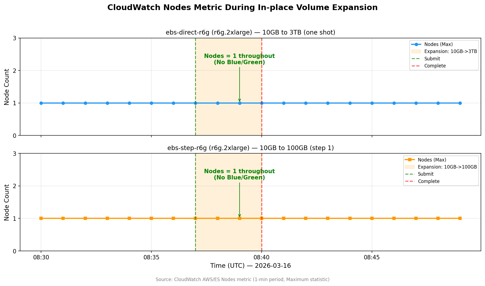

# OpenSearch Service 原地扩容实测：10GB 直扩 3TB，告别 Blue/Green 部署

!!! info "Lab 信息"
    - **难度**: ⭐⭐ 中级
    - **预估时间**: 60 分钟（含 6h cooldown 等待）
    - **预估费用**: ~$37（含 r6g.2xlarge cooldown 等待时间）
    - **Region**: us-east-1
    - **最后验证**: 2026-03-17

## 背景

OpenSearch Service 变更集群配置（实例类型、存储大小等）通常会触发 **Blue/Green 部署**——系统创建一套全新的节点，迁移数据后切换流量，最后销毁旧节点。对于大型集群（比如 11 个数据节点），这意味着：

- 节点数临时翻倍（11 → 22），master 节点压力倍增
- 搜索和索引延迟上升
- 可能出现请求拒绝（429 错误）
- 数据迁移耗时可达数小时

2026 年 3 月 10 日，AWS 宣布 **取消 gp3 卷原地扩容的 3 TiB 上限**。此前，只有 ≤3 TiB 的 gp3 扩容能走 DynamicUpdate（原地扩容）；现在所有卷大小的增长都不再触发 Blue/Green。

这对日志分析、可观测性等需要频繁扩容存储的场景来说，是一个非常实用的改进。

**本文通过两轮实测，验证这个功能的实际表现。**

## 前置条件

- AWS 账号（需要 OpenSearch Service 相关权限）
- AWS CLI v2 已配置
- 了解 OpenSearch Service 基本概念（域、节点、EBS 卷）

## 核心概念

### 什么变了？

| | 之前（2026-03-10 前） | 之后 |
|---|---|---|
| gp3 卷扩容 ≤3 TiB | DynamicUpdate（原地） | DynamicUpdate（原地） |
| gp3 卷扩容 >3 TiB | **Blue/Green 部署** | **DynamicUpdate（原地）** ✅ |
| 卷缩容 | Blue/Green 部署 | Blue/Green 部署（不变） |
| 6h 内再次变更卷 | Blue/Green 部署 | Blue/Green 部署（不变） |

### 三个例外仍会触发 Blue/Green

1. **缩容**：减小卷大小始终触发 Blue/Green
2. **6 小时冷却期**：上次卷变更后 6 小时内再次变更
3. **历史大卷首次扩容**：功能发布前已有 >3 TiB 卷的域，首次扩容仍需 Blue/Green（之后不再需要）

### Dry-run：扩容前的安全检查

OpenSearch 提供 `--dry-run` 参数，让你在实际执行前确认变更是 `DynamicUpdate` 还是 `Blue/Green`。**强烈建议每次扩容前都跑一次。**

```bash
aws opensearch update-domain-config \
  --domain-name my-domain \
  --ebs-options 'EBSEnabled=true,VolumeType=gp3,VolumeSize=3072' \
  --dry-run \
  --query 'DryRunResults.DeploymentType'
```

返回 `"DynamicUpdate"` 就是安全的原地扩容，`"Blue/Green"` 则会触发完整部署。

## 动手实践

### 测试设计

我们设计了两轮对比测试：

**Round 1（小实例验证基本行为）：**

| 域名 | 实例类型 | 扩容路径 | 目的 |
|------|---------|----------|------|
| `ebs-direct` | t3.small.search | 10GB → 100GB | 一步到位 |
| `ebs-step` | t3.small.search | 10GB → 50GB → 100GB | 逐步扩容 |

**Round 2（大实例测试 3TB 大卷）：**

| 域名 | 实例类型 | 扩容路径 | 目的 |
|------|---------|----------|------|
| `ebs-direct-r6g` | r6g.2xlarge.search | 10GB → 3TB | 一步跨越 300x |
| `ebs-step-r6g` | r6g.2xlarge.search | 10GB → 100GB → 1TB → 3TB | 逐步扩容 |

每步操作流程：dry-run → 执行扩容 → 轮询 Processing 状态 → 记录耗时 → 观察节点数变化

### Step 1: 创建测试域

以 Round 2 的 r6g.2xlarge 域为例（Round 1 流程相同，只是实例类型不同）：

```bash
aws opensearch create-domain \
  --domain-name ebs-direct-r6g \
  --engine-version OpenSearch_2.17 \
  --cluster-config '{"InstanceType":"r6g.2xlarge.search","InstanceCount":1,"ZoneAwarenessEnabled":false}' \
  --ebs-options '{"EBSEnabled":true,"VolumeType":"gp3","VolumeSize":10}' \
  --encryption-at-rest-options '{"Enabled":true}' \
  --node-to-node-encryption-options '{"Enabled":true}' \
  --domain-endpoint-options '{"EnforceHTTPS":true}' \
  --advanced-security-options '{"Enabled":true,"InternalUserDatabaseEnabled":true,"MasterUserOptions":{"MasterUserName":"admin","MasterUserPassword":"Test12345!"}}' \
  --region us-east-1
```

域创建约需 15-20 分钟。等 `Processing: false` 后开始测试。

### Step 2: Dry-run 验证

并行对两域执行 dry-run：

```bash
# 一步到位：10GB → 3TB
aws opensearch update-domain-config \
  --domain-name ebs-direct-r6g \
  --ebs-options 'EBSEnabled=true,VolumeType=gp3,VolumeSize=3072' \
  --dry-run \
  --query 'DryRunResults.DeploymentType' \
  --region us-east-1

# 逐步：10GB → 100GB（第一步）
aws opensearch update-domain-config \
  --domain-name ebs-step-r6g \
  --ebs-options 'EBSEnabled=true,VolumeType=gp3,VolumeSize=100' \
  --dry-run \
  --query 'DryRunResults.DeploymentType' \
  --region us-east-1
```

**两个都返回 `"DynamicUpdate"`** ✅ — 确认不会触发 Blue/Green。

### Step 3: 执行扩容并观察

去掉 `--dry-run`，并行提交两域扩容：

```bash
# 一步到位：10GB → 3TB
aws opensearch update-domain-config \
  --domain-name ebs-direct-r6g \
  --ebs-options 'EBSEnabled=true,VolumeType=gp3,VolumeSize=3072' \
  --region us-east-1

# 逐步：10GB → 100GB
aws opensearch update-domain-config \
  --domain-name ebs-step-r6g \
  --ebs-options 'EBSEnabled=true,VolumeType=gp3,VolumeSize=100' \
  --region us-east-1
```

然后轮询 Processing 状态：

```bash
aws opensearch describe-domain \
  --domain-name ebs-direct-r6g \
  --region us-east-1 \
  --query 'DomainStatus.{Processing:Processing,VolumeSize:EBSOptions.VolumeSize,NodeCount:ClusterConfig.InstanceCount}'
```

### Step 4: 验证 6h Cooldown 机制

扩容完成后立即对 `ebs-step-r6g` 做下一步的 dry-run：

```bash
aws opensearch update-domain-config \
  --domain-name ebs-step-r6g \
  --ebs-options 'EBSEnabled=true,VolumeType=gp3,VolumeSize=1024' \
  --dry-run \
  --query 'DryRunResults.DeploymentType' \
  --region us-east-1
```

返回 `"Blue/Green"` ⚠️ — 确认 6 小时冷却期内再次扩容会回退到 Blue/Green 部署。

## 测试结果

### 完整数据

| 轮次 | 域 | 实例类型 | 扩容路径 | Dry-run | 执行耗时 | 部署类型 | 节点翻倍 |
|------|---|---------|----------|---------|---------|---------|---------|
| R1 | ebs-direct | t3.small | 10→100GB | DynamicUpdate | ~3 min | DynamicUpdate ✅ | ❌ |
| R1 | ebs-step | t3.small | 10→50GB | DynamicUpdate | ~3 min | DynamicUpdate ✅ | ❌ |
| R2 | ebs-direct-r6g | r6g.2xlarge | **10→3072GB** | DynamicUpdate | **~3.5 min** | DynamicUpdate ✅ | ❌ |
| R2 | ebs-step-r6g | r6g.2xlarge | 10→100GB | DynamicUpdate | ~3.5 min | DynamicUpdate ✅ | ❌ |
| R2 | ebs-step-r6g | r6g.2xlarge | 100→1024GB | DynamicUpdate | ~4 min | DynamicUpdate ✅ | ❌ |
| R2 | ebs-step-r6g | r6g.2xlarge | **1024→3072GB** | DynamicUpdate | **~3.5 min** | DynamicUpdate ✅ | ❌ |

### Cooldown 验证

| 时机 | 域 | 扩容路径 | Dry-run 结果 |
|------|---|----------|-------------|
| 扩容完成后 <1 min | ebs-step (R1) | 50→100GB | **Blue/Green** ⚠️ |
| 扩容完成后 <1 min | ebs-step-r6g (R2) | 100→1024GB | **Blue/Green** ⚠️ |
| 扩容完成后 <1 min | ebs-step-r6g (R2) | 1024→3072GB | **Blue/Green** ⚠️ |
| cooldown 6h+ 后 | ebs-step-r6g (R2) | 100→1024GB | DynamicUpdate ✅ |
| cooldown 11h+ 后 | ebs-step-r6g (R2) | 1024→3072GB | DynamicUpdate ✅ |

### CloudWatch 节点数监控：确认无 Blue/Green

下图是扩容期间 CloudWatch `Nodes` 指标（1 分钟粒度，Maximum 统计）的实际数据。Blue/Green 部署的典型特征是节点数翻倍（1 → 2），而 DynamicUpdate 期间节点数保持不变。



两域在整个扩容过程中（橙色区域），节点数始终为 **1.0** — 没有任何节点翻倍，**铁证** DynamicUpdate 生效。

### 关键发现

**1. 扩容幅度不影响耗时**

10GB → 100GB（10 倍）和 10GB → 3TB（300 倍）的 Processing 时间几乎相同，都在 3-3.5 分钟左右。底层 EBS 的扩容是异步的，OpenSearch 端只需要更新配置元数据。

**2. 实例类型不影响扩容行为**

t3.small.search 和 r6g.2xlarge.search 表现一致 — DynamicUpdate 的行为与实例大小无关，核心取决于 EBS 层面的修改类型。

**3. 节点数全程不变**

所有测试中，节点数始终保持 1（单节点配置），没有出现 Blue/Green 特有的节点翻倍现象。这意味着：

- 不会有临时的双倍资源消耗
- 不会有数据迁移开销
- 不会有搜索/索引性能抖动

**4. 6h Cooldown 是硬限制**

扩容完成后 6 小时内再次修改卷大小，**必定** 触发 Blue/Green。这不是 OpenSearch 特有的，而是底层 EBS 的 modification cooldown。

!!! warning "生产环境注意"
    如果你的集群需要频繁扩容，务必规划好扩容步长，避免短时间内多次扩容。一次性扩到位远优于多次小幅扩容。

## 踩坑记录

!!! warning "坑 1：实例类型的 EBS 卷大小限制"
    `t3.small.search` 的 gp3 卷上限是 **100GB**，尝试设置更大的值会报错：
    ```
    LimitExceededException: Volume size must be between 10 and 100 for t3.small.search
    ```
    **教训**：大卷测试需要更大的实例类型。测试前先确认实例类型支持的 EBS 范围。

!!! warning "坑 2：Region 混淆"
    域创建在 `us-east-1`，但 CLI 默认 profile 指向 `us-west-2`。多次以为域不存在。
    **教训**：所有命令显式加 `--region`，不要依赖默认配置。

## 费用明细

| 资源 | 单价 | 用量 | 费用 |
|------|------|------|------|
| t3.small.search x2 | $0.036/hr | ~8 hr | ~$0.58 |
| r6g.2xlarge.search x2 | $0.578/hr | ~30 hr | ~$34.68 |
| gp3 存储（峰值 ~6.2TB） | $0.08/GB-mo | ~1 day | ~$1.50 |
| **合计（Round 1+2）** | | | **~$37** |

!!! note "费用说明"
    主要费用来自等待 cooldown 期间 r6g.2xlarge 实例的持续计费。如果只做一步到位的测试（不含逐步扩容），费用约 $5。

## 清理资源

```bash
# 删除 Round 1 的域
aws opensearch delete-domain --domain-name ebs-step --region us-east-1
aws opensearch delete-domain --domain-name ebs-direct --region us-east-1

# 删除 Round 2 的域
aws opensearch delete-domain --domain-name ebs-step-r6g --region us-east-1
aws opensearch delete-domain --domain-name ebs-direct-r6g --region us-east-1
```

!!! danger "务必清理"
    r6g.2xlarge.search 实例费用 $0.578/hr/台，**4 个域不清理一天就是 ~$55**。测试完成后立即删除。

## 结论与建议

### 功能验证结论

✅ **原地扩容确实有效**：10GB 直接扩到 3TB，全程 DynamicUpdate，无 Blue/Green 部署
✅ **耗时与扩容幅度无关**：不论扩多少，Processing 都在 3-4 分钟
✅ **6h Cooldown 是硬限制**：短间隔再次扩容会强制 Blue/Green

### 生产环境建议

1. **一次扩到位**：既然扩容幅度不影响耗时，没必要逐步扩容。算好未来 6-12 个月的容量需求，一步到位
2. **扩容前必跑 dry-run**：花 5 秒确认部署类型，避免意外 Blue/Green
3. **避免 6h 内重复扩容**：如果判断失误需要二次扩容，要么等 6h，要么接受 Blue/Green 的代价
4. **监控 EBS 用量**：设置 CloudWatch 告警（如 `FreeStorageSpace < 20%`），提前扩容而非等到紧急时刻
5. **实例类型决定卷上限**：选型时确认实例支持的最大 EBS 卷大小，避免后期被卡住

### 适用场景

- 日志分析 / 可观测性平台：数据增长快，需要频繁扩容
- 大数据搜索：索引量大，TB 级存储常见
- 多租户 SaaS：客户增长带来的存储需求波动

## 参考链接

- [What's New: In-place volume increases for all volume sizes](https://aws.amazon.com/about-aws/whats-new/2026/03/amazon-opensearch-service-in-place-volume/)
- [Making configuration changes in Amazon OpenSearch Service](https://docs.aws.amazon.com/opensearch-service/latest/developerguide/managedomains-configuration-changes.html)
- [Amazon OpenSearch Service quotas](https://docs.aws.amazon.com/opensearch-service/latest/developerguide/limits.html)
